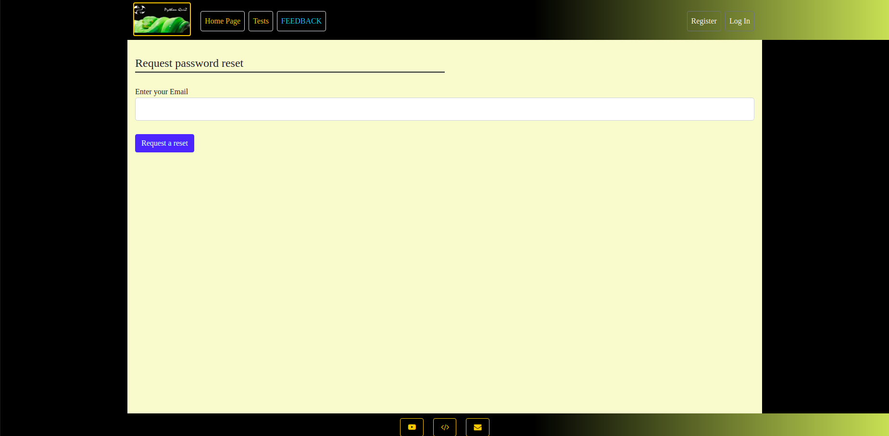

### Description:

---

EPAM Python Autumn 2021 Final Project. The project is a prototype Python quiz web application created and styled after 
"Real Python" quizzes on Python-related topics.

### Project structure:

---

1. documentation - a folder with HTML prototypes, SQL Database structure, readme file
2. logs - a folder with files containing logged information managed by the project's loggers
3. migrations - a folder with changes in ORM tables to alter the data in existing SQL Database
4. src - a folder with core Python scripts which manage the Backend logic of the application
    + auth - an app folder which embodies registration/authentication procedure and personal profile
    + errors - an app folder which allows display of custom HTTP status code errors
    + main - an app folder which manages the visualisation of the Homepage and SQL DB operations
    + posts - an app folder which enables leaving feedback to the taken tests
    + quiz - an app folder with major project logic which allows taking tests and other related operations
    + static - a folder with static files: images, .css, .js etc.
    + templates - a folder with HTML templates
5. tests - a folder with QA tests to ensure the efficiency of the project code

### Implementation:

---

Start your interaction with the application with registration.
<<<<<<< HEAD

Fill in the form fields and check the ReCaptcha box.

You can edit your personal profile data any time.

You are free to Log Out and Log In later.

In case you have forgotten your password you may restore it by following the restoration instructions.

From the list of existing tests select a test to take and click the details button.

On the page with details about the test you will see extra information and may start taking the test.

Read the question and pick an option you consider correct.

Having finished the test, you may see your results. 

=======

Fill in the form fields and check the ReCaptcha box.

You can edit your personal profile data any time.

You are free to Log Out and Log In later.

In case you have forgotten your password you may restore it by following the restoration instructions.

From the list of existing tests select a test to take and click the details button.

On the page with details about the test you will see extra information and may start taking the test.

Read the question and pick an option you consider correct.

Having finished the test, you may see your results. 

>>>>>>> main

If you have any propositions concerning the quiz, feel free 
to leave your feedback.

<<<<<<< HEAD

Your messages would be available on the FEEDBACK page, editable and removable.

=======

Your messages would be available on the FEEDBACK page, editable and removable.

>>>>>>> main

---

### Technologies:

1. Python (Flask with extendables)
2. Bootstrap 5 (.css, .js)
3. NGinx
4. GUnicorn
5. Supervisor

---

## Commercial INFO

Project created in 2021-2022 for educational purposes.
 
© All rights reserved.
